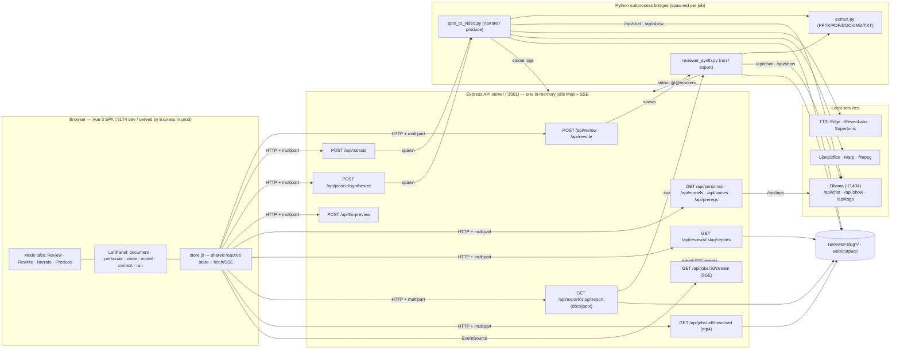
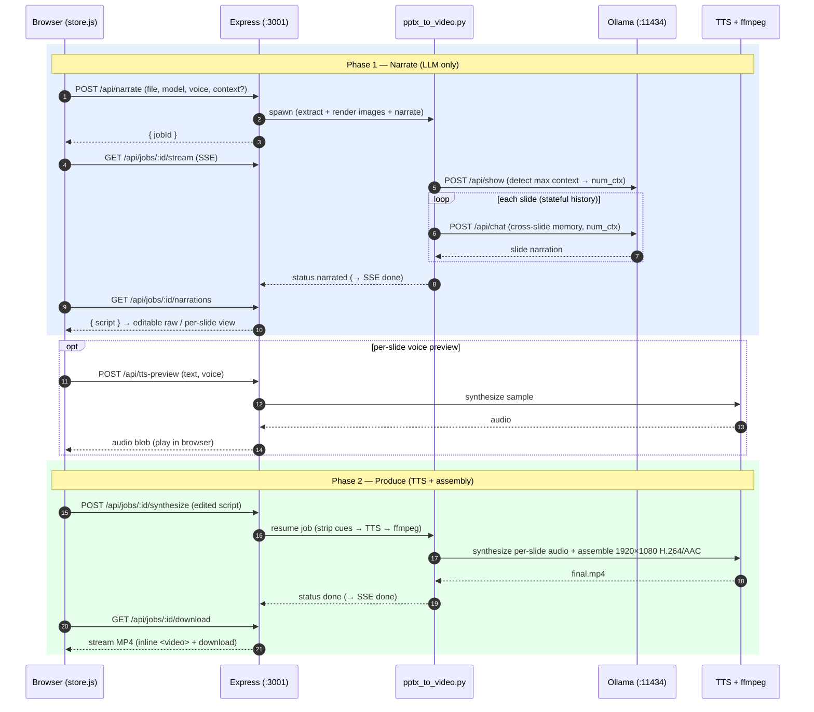

# SAM Slide Suite — Workflow & Architecture Diagrams

These Mermaid diagrams show how the **web UI**, the **Express API services**, the
**Python subprocess bridges**, and the **local LLM / TTS** pieces interact.

GitHub renders Mermaid natively. For other viewers, paste a block into
<https://mermaid.live>.

---

## 1. Component topology

How the layers connect: the Vue SPA talks only to Express; Express spawns
short-lived Python helpers that call Ollama and the media tools.



---

## 2. Review / Rewrite workflow

Multi-persona fan-out, optional synthesis, and review-informed rewrite. Express
parses the helper's `@@STATE`/`@@REPORT`/`@@DONE` stdout markers into typed SSE
events.

```mermaid
sequenceDiagram
    autonumber
    participant B as Browser (store.js)
    participant E as Express (:3001)
    participant R as reviewer_synth.py
    participant O as Ollama (:11434)
    participant D as reviews/&lt;slug&gt;/

    B->>E: POST /api/review (file|text, personas[], model, context?)
    E->>R: spawn run --personas … --model … [--context-file]
    E-->>B: { jobId, docSlug }
    B->>E: GET /api/jobs/:id/stream (SSE)

    R->>R: extract.py → _extracted.md
    R->>O: POST /api/show (detect max context → num_ctx)
    par up to 3 personas in parallel
        R->>O: POST /api/chat (persona brief + context + slides, num_ctx)
        O-->>R: persona review markdown
        R->>D: write <persona>.md
        R-->>E: @@STATE/@@REPORT  (→ SSE persona/report events)
    end

    alt 2+ reviewers succeeded
        R->>O: POST /api/chat (merge reviews → synthesis)
        O-->>R: synthesis markdown
        R->>D: write 00-SYNTHESIS.md
    else single reviewer
        R->>R: skip synthesis (nothing to merge)
    end
    R-->>E: @@DONE state=complete  (→ SSE done)

    B->>E: GET /api/reviews/:slug/reports
    E->>D: read report markdown
    E-->>B: { reports[] } → render tabs + compare

    Note over B,R: Rewrite reuses this flow with mode=rewrite.<br/>Prior review findings for the same slug are auto-injected,<br/>and "Advise" adds [DRAFT:] content for each [NEEDS:] gap.

    B->>E: GET /api/export/:slug/:report.(docx|pptx)
    E->>R: spawn export --format …
    R-->>E: file bytes
    E-->>B: download
```

---

## 3. Narrate / Produce workflow

Two phases that share one job id: phase 1 generates an editable script; phase 2
synthesizes audio and assembles the MP4.



---

## Notes

- **One server, one SSE channel.** Every mode reuses the in-memory `jobs` Map and
  `GET /api/jobs/:id/stream`; review/rewrite add typed `persona`/`report`/`slug`
  events on top of the generic `log`/`done` events.
- **Subprocess bridge pattern.** Python does the heavy lifting and streams stdout;
  Node never embeds a second long-running server.
- **Context window.** Both bridges call Ollama `/api/show` and pass the model's
  max `num_ctx`, so stacked review prompts and stateful narration history aren't
  truncated (`REVIEWER_NUM_CTX` / `NARRATE_NUM_CTX` override).
