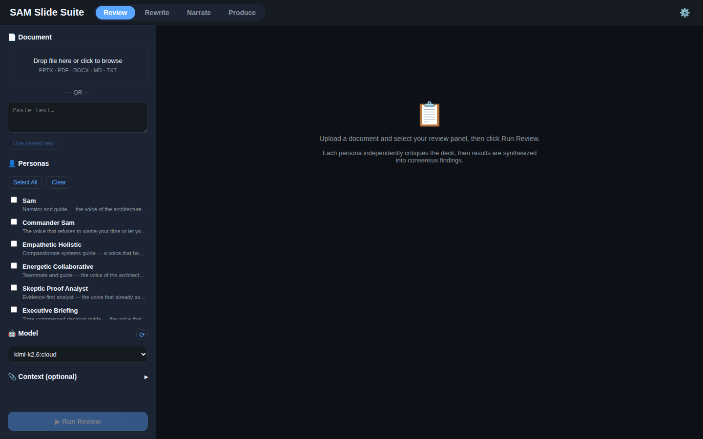
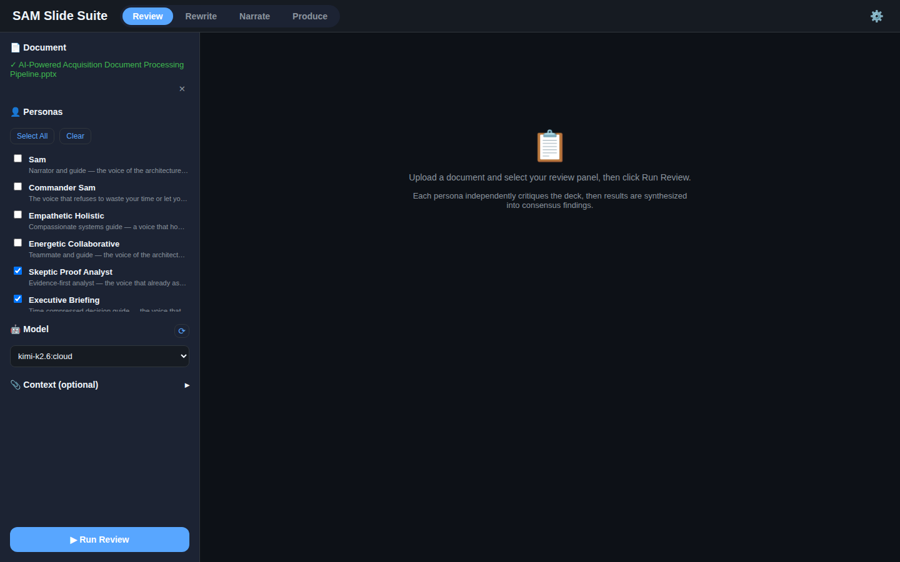
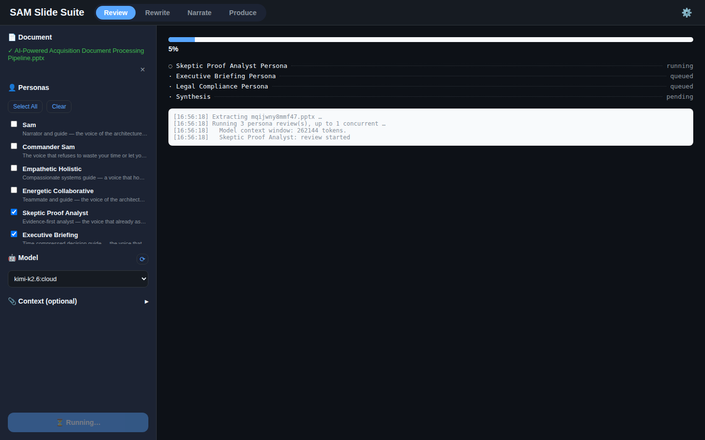
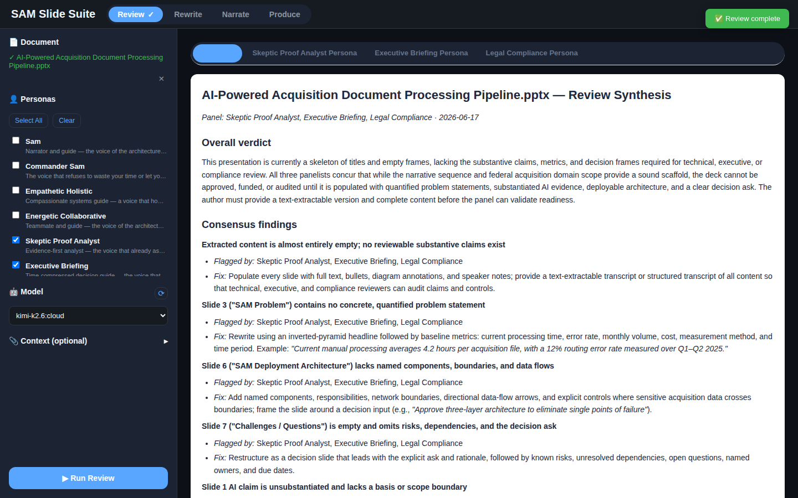
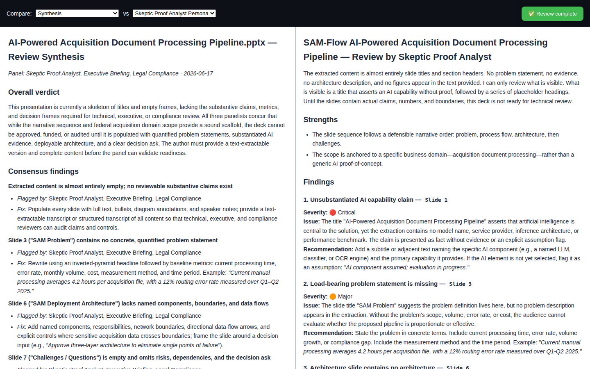
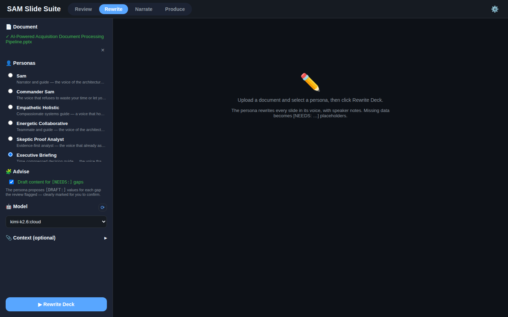
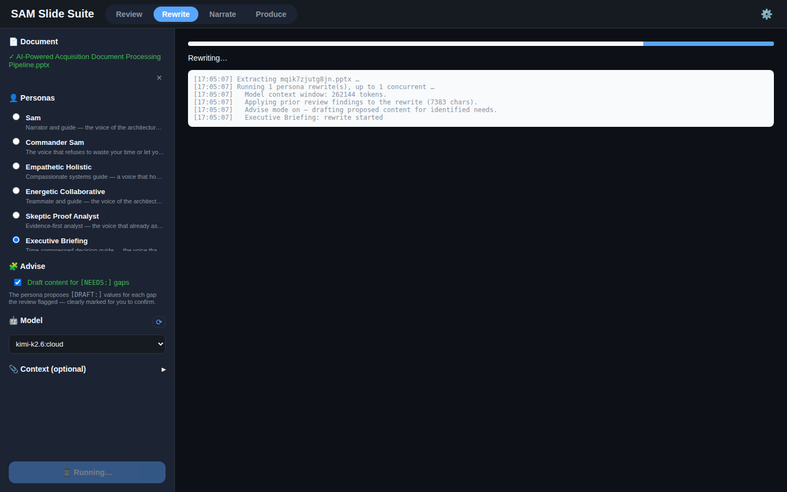
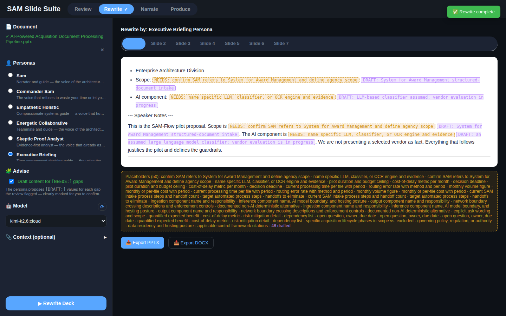
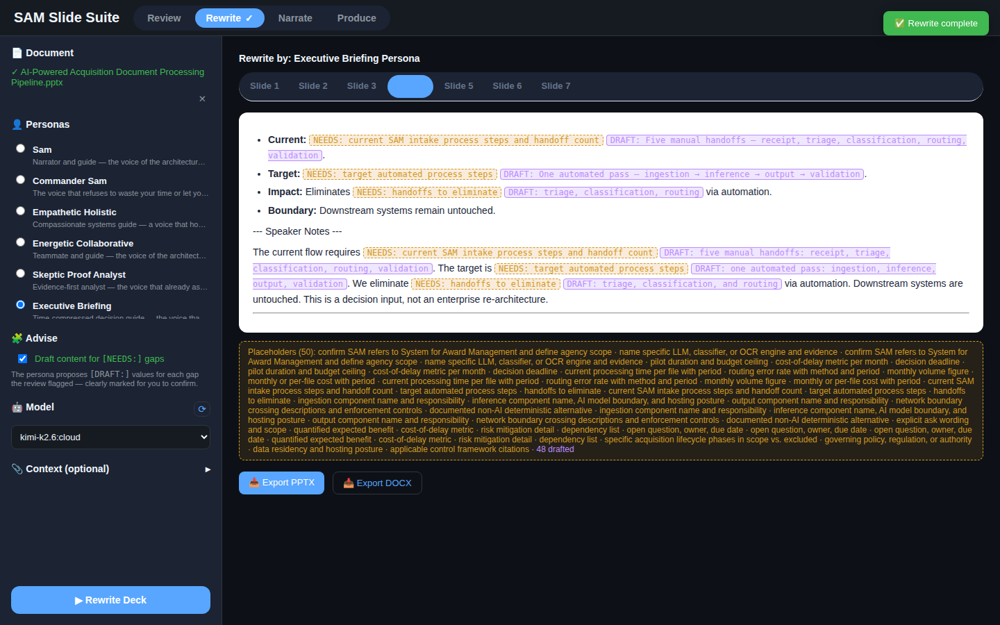

# SAM Slide Suite — UI Walkthrough: Review & Rewrite

A stage-by-stage tour of the **Review** and **Rewrite** workflows, captured from
the running app.

- **Document:** `AI-Powered Acquisition Document Processing Pipeline.pptx`
- **Model:** local Ollama (`kimi-k2.6:cloud`)
- **Review panel:** Skeptic-Proof Analyst · Executive Briefing · Legal/Compliance
- **Rewrite persona:** Executive Briefing, with **Advise** enabled

All screenshots are real runs (theme: *mixed* — dark chrome, light reading
cards). The two workflows share one document and the same left config panel; only
the persona-selection mode and the right output panel change per tab.

---

## Review

### 1. Empty state
Pick the Review tab, and the right panel explains the flow while you configure the
left panel.

### 2. Configured — document + review panel
The deck is uploaded (extracted via `extract.py`) and confirmed in the Document
section. In Review mode personas are **multi-select** (checkboxes) with
Select All / Clear; here three are chosen. The Model picker shows the detected
Ollama model with a refresh (`⟳`) button.

### 3. Running — live per-persona progress
On Run Review, each persona streams status (queued → running → done) over SSE,
with a progress bar and a live log. The log shows extraction, the auto-detected
model context window, and each reviewer starting.

### 4. Results — synthesis + per-persona reports
When the panel finishes, a synthesis pass merges the reviews. The **Synthesis**
tab (consensus findings, conflicts weighted by each persona's blind spots, unique
catches, top-5 priority fixes) sits first, followed by one tab per persona.
Export DOCX and Compare are below.

### 5. Compare — two reports side by side
The Compare overlay puts any two reports next to each other (each pane scrolls
independently) for quick cross-persona reading.

---

## Rewrite

### 6. Configured — single persona + Advise
Switching to Rewrite keeps the same document. Personas become **single-select**
(radio). The Rewrite-only **🧩 Advise** toggle is enabled here, so the persona
will draft proposed content for each gap the review flagged.

### 7. Running
Run Rewrite streams progress while the persona rewrites the whole deck. It
automatically folds in the prior review's findings for this document.

### 8. Results — rewritten slides with NEEDS / DRAFT
Each slide becomes a tab showing the rewritten on-slide content plus speaker
notes. Gaps the review surfaced appear as amber **`NEEDS:`** markers; because
Advise is on, each is followed by a purple **`DRAFT:`** proposal — a labeled,
unverified starting point to confirm or replace. Export PPTX (real speaker-notes
pages) and Export DOCX are below.

### 9. Another slide
Stepping through the slide tabs shows the same structure per slide — rewritten
content, speaker notes, and any NEEDS/DRAFT markers.

---

## How these were captured

Headless Chrome (via `puppeteer-core`) drove the built app served by Express on
`:3001`, uploading the deck and walking each stage against a local Ollama model.
Reviews ran sequentially (`REVIEW_CONCURRENCY=1`) for deterministic capture. To
regenerate, serve the app, then drive the same steps with any browser-automation
tool.
